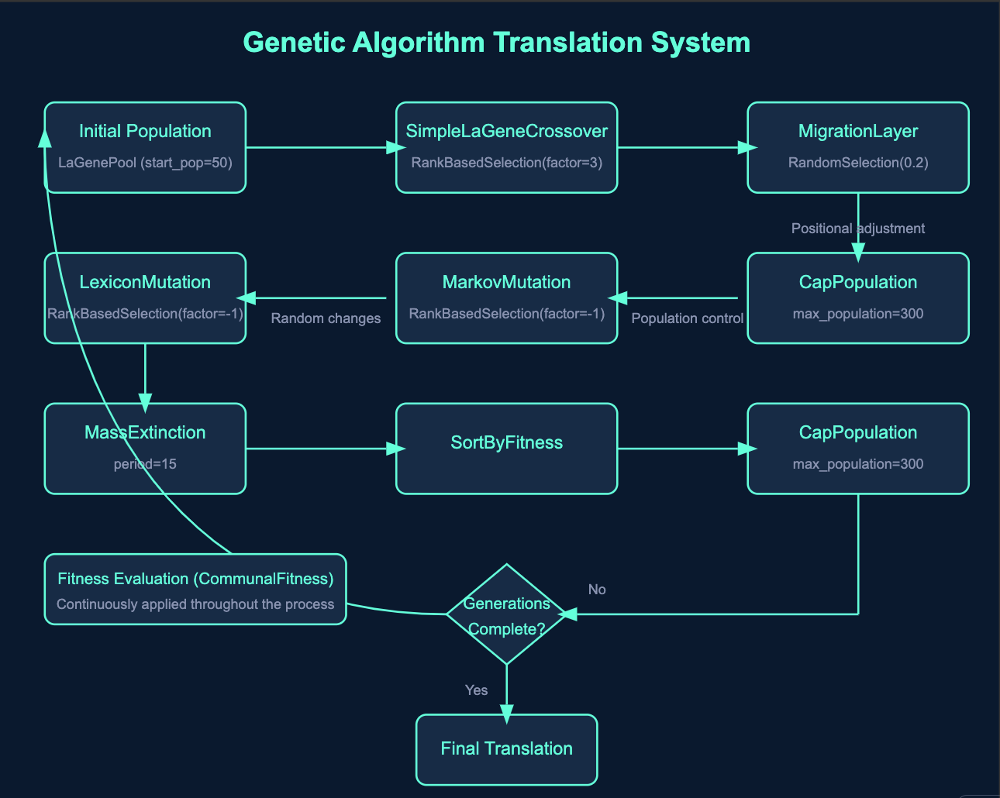

# Genetic Algorithm Translation System



## Overview
* Disclaimer, I wrote most of the code (Claude isn't great at genetic algorithms with frameworks it doesn't know like Finch), but Claude did write the readme to save time.
* Take it with a grain of salt...
* But it is pretty accurate to get the gist of this project.

This project implements an innovative approach to machine translation using genetic algorithms. By combining evolutionary computation techniques with natural language processing, we've created a system that evolves translation rules (LaGenes) to improve translation quality over time.

## Key Components

### LaGenes
LaGenes are the fundamental units of our system. Each LaGene represents a translation pair (source word/phrase → target word/phrase) along with additional properties like positional rank and shift.

### LaGenePool
The LaGenePool manages the population of LaGenes. It handles the creation of new LaGenes and provides methods for finding similar sentences using TF-IDF and cosine similarity.

### Evolutionary Layers
Our system uses several specialized layers to evolve the population of LaGenes:

1. **SimpleLaGeneCrossover**: Combines LaGenes to create new ones.
2. **MigrationLayer**: Adjusts the positional ranking of LaGenes based on their context.
3. **MarkovMutation** and **LexiconMutation**: Introduce variations in the LaGenes.
4. **MassExtinction**: Periodically removes low-performing LaGenes.
5. **SortByFitness**: Organizes LaGenes based on their performance.
6. **CapPopulation**: Maintains the population size within specified limits.

### Fitness Evaluation
The CommunalFitness class evaluates the performance of LaGenes by comparing translations with and without each LaGene. This continuous evaluation drives the evolutionary process.

## How It Works

1. **Initialization**: The system starts with a population of randomly generated LaGenes.
2. **Evolution**: Through multiple generations, the system applies various evolutionary operations:
   - Crossover combines successful LaGenes.
   - Mutation introduces random changes to maintain diversity.
   - Migration adjusts LaGene positions based on context.
   - Fitness evaluation continuously assesses LaGene performance.
3. **Selection**: Better-performing LaGenes are more likely to survive and reproduce.
4. **Termination**: The process continues for a specified number of generations.
5. **Output**: The final population of LaGenes is used to produce the translated text.

## Key Features

- **Adaptive Learning**: The system learns and improves translations over time.
- **Context-Aware**: Uses TF-IDF and cosine similarity to consider context in translations.
- **Flexible Architecture**: Modular design allows easy addition or modification of evolutionary layers.
- **Performance Tracking**: Includes tools for plotting fitness history and population size.

## Usage

To run the system:

1. Prepare your source and target text files.
2. Configure the parameters in the script (population size, number of generations, etc.).
3. Run the main script:

```python
python implementation_one.py
```

4. The system will evolve the translations and output the final result.

## Future Directions

- Implement more sophisticated crossover and mutation strategies.
- Explore integration with neural machine translation models.
- Develop a user interface for real-time translation and system monitoring.

## Contributing

We welcome contributions! Please see our contributing guidelines for more information on how to get involved.

## License

This project is licensed under the MIT License - see the LICENSE file for details.
